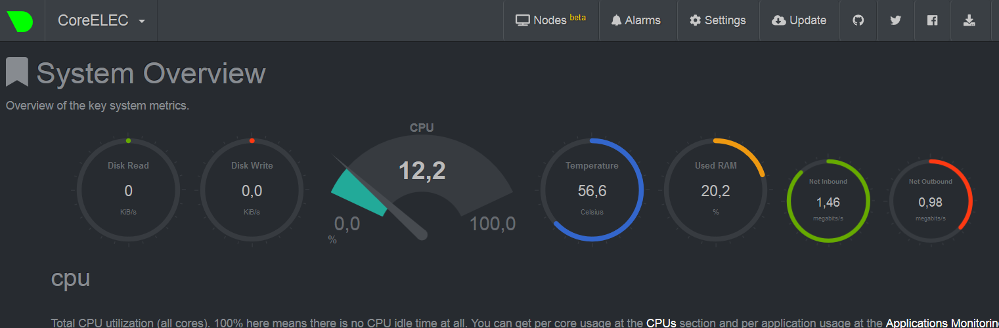

# netdata-coreelec-sensors
Monitoring SBC temperature in CoreElec with Netdata in Docker

# About

This script is based on [LinuxServer.io](http://linuxserver.io) shell script from [libreelec-addon-repo](https://github.com/linuxserver/libreelec-addon-repo/tree/master/docker.linuxserver.netdata).

Script was modified to mount additional config files allowing temperature monitoring on SBC's like Khadas VIM3 and Raspberry Pi.
Modifications are based on following sources:
1. [Netdata for IoT](https://docs.netdata.cloud/docs/netdata-for-iot/) for activating temperature sensors
2. [CoreElec HW monitor](https://discourse.coreelec.org/t/coreelec-hw-monitor) discussion ( thanks to Martynet,  relkai and Uukrul for scripts and hints)
3. [Anonymous Statistics](https://github.com/netdata/netdata/blob/master/docs/anonymous-statistics.md) page for disabling statistics.
